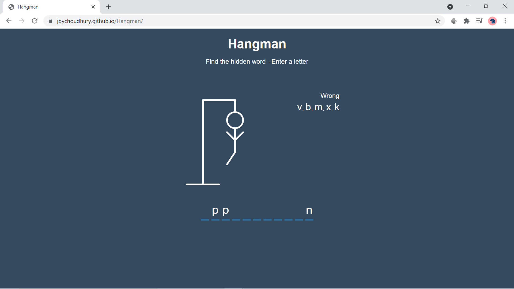

# Hangman Game

This project has been made using :
 
    a)  HTML
    b)  CSS
    c)  React Js

Project is deployed at : [https://joychoudhury.github.io/Hangman/](https://joychoudhury.github.io/Hangman/)

Technical:

-   Use of SVG for drawing 
-   Display wrong words and correct words
-   Notification when select a letter twice
-   Show popup on win or lose
-   Play Again button 

## Working Images

